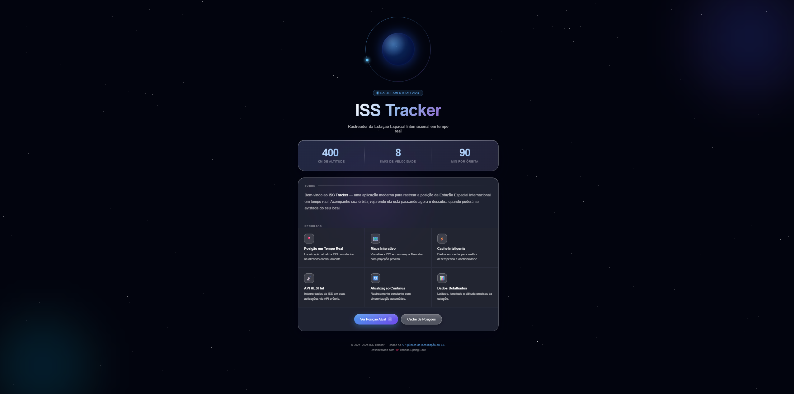
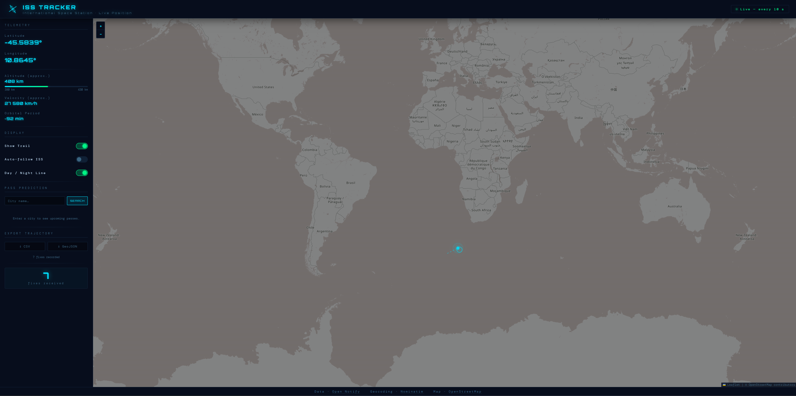

# 🛰️ ISS Tracker - Real-Time International Space Station Tracking

A full-stack application built with Spring Boot and modern web technologies to track the International Space Station (ISS) in real-time on an interactive map.

## ✨ Key Features

-   **Live Tracking**: Real-time position of the ISS updated on a world map.
-   **Data Streaming**: Utilizes Server-Sent Events (SSE) for efficient, unidirectional data flow from backend to frontend.
-   **Interactive UI**: A sleek, responsive, dark-themed interface with various controls.
-   **Day/Night Visualization**: Displays the terminator line on the map, showing the separation between day and night on Earth.
-   **Pass Prediction**: Predicts upcoming ISS passes over a specified city.
-   **Trajectory Export**: Allows exporting the recorded ISS trajectory data in CSV or GeoJSON formats.
-   **RESTful API**: A well-documented API for accessing ISS position data.

---

## 📸 Screenshots


_The main interface of the ISS Tracker application._


_A detailed view of the interactive map with the ISS and terminator line._


_A view of the map displaying the trajectory trail of the ISS over time._

---

## 🚀 Backend Details

The backend is a reactive, non-blocking application built on the Spring ecosystem.

-   ☕ **Java 21 & Spring Boot**: The core foundation, providing a robust, modern, and high-performance server environment.
-   ⚡ **Spring WebFlux**: Used to create a fully reactive API, perfect for handling real-time data streams with Server-Sent Events (SSE).
-   ☁️ **Spring Cloud OpenFeign**: Simplifies the process of making HTTP requests to the external Open Notify API to fetch the raw ISS location data.
-   ⏱️ **Quartz Scheduler**: Manages scheduled tasks to periodically poll the external API, ensuring the local data cache is always up-to-date.
-   🔀 **MapStruct & Lombok**: These tools drastically reduce boilerplate code. Lombok generates constructors, getters, and setters, while MapStruct handles the mapping between DTOs and data entities.
-   🩺 **Spring Boot Actuator**: Provides production-ready endpoints for monitoring application health, metrics, and other internal states.
-   🔗 **Spring HATEOAS**: Enables the creation of REST representations that include discoverable links, making the API more self-descriptive.
-   📚 **Springdoc OpenAPI (Swagger)**: Automatically generates interactive API documentation, allowing developers to easily explore and test the available endpoints.

---

## 🗺️ Frontend Details

The frontend is a single-page application crafted with vanilla HTML, CSS, and JavaScript, focusing on performance and a clean user experience.

-   🍃 **Leaflet.js**: A lightweight and powerful open-source library for creating interactive maps. The map tiles are provided by OpenStreetMap.
-   ☀️/🌙 **Leaflet.Terminator**: A fascinating plugin that draws and updates the day/night terminator line on the map, providing a clear visual of where the sun is shining.
-   📡 **Server-Sent Events (SSE)**: The frontend subscribes to the `/api/iss/stream` endpoint to receive live position updates from the server without the overhead of traditional polling.
-   🎨 **Custom UI (HTML/CSS/JS)**: A responsive, dark-themed interface designed to look like a futuristic mission control dashboard. It includes:
    -   **Telemetry Panel**: Displays key data like Latitude, Longitude, Altitude, and Velocity.
    -   **Display Controls**: Toggles for showing the ISS trail, auto-following the station, and displaying the day/night line.
    -   **Pass Prediction**: An input to search for a city and view a list of upcoming ISS passes.
    -   **Data Export**: Buttons to download the collected trajectory data.

---

## 🛠️ Technologies & Tools

-   **Backend**: Java 21, Spring Boot, WebFlux, OpenFeign, Quartz, MapStruct, Lombok
-   **Frontend**: HTML5, CSS3, JavaScript (ES6+), Leaflet.js
-   **Build**: Apache Maven
-   **API Docs**: Springdoc OpenAPI (Swagger)

---

## 🚀 Getting Started

1.  **Clone the repository:**
    ```sh
    git clone <repository-url>
    ```

2.  **Navigate to the project directory:**
    ```sh
    cd springboot-iss-tracker
    ```

3.  **Run the application using Maven:**
    ```sh
    ./mvnw spring-boot:run
    ```

4.  **Open your browser** and go to `http://localhost:8080`.

---

## 📄 API Endpoints

-   `GET /api/iss/position`: Fetches the last known position of the ISS.
-   `GET /api/iss/stream`: Subscribes to a real-time stream (SSE) of ISS position updates.
-   `GET /swagger-ui.html`: Access the interactive API documentation.